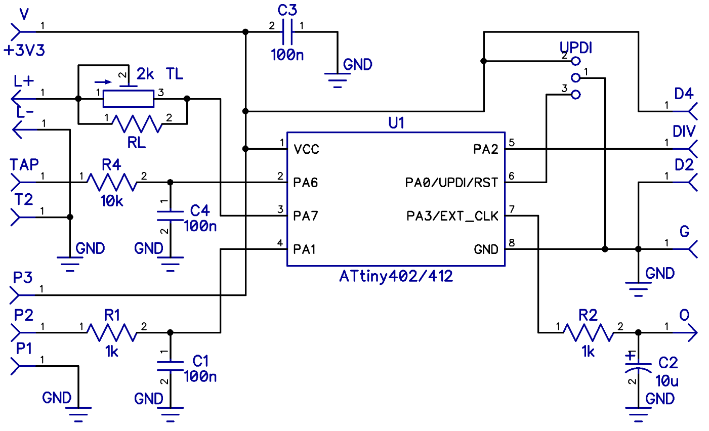
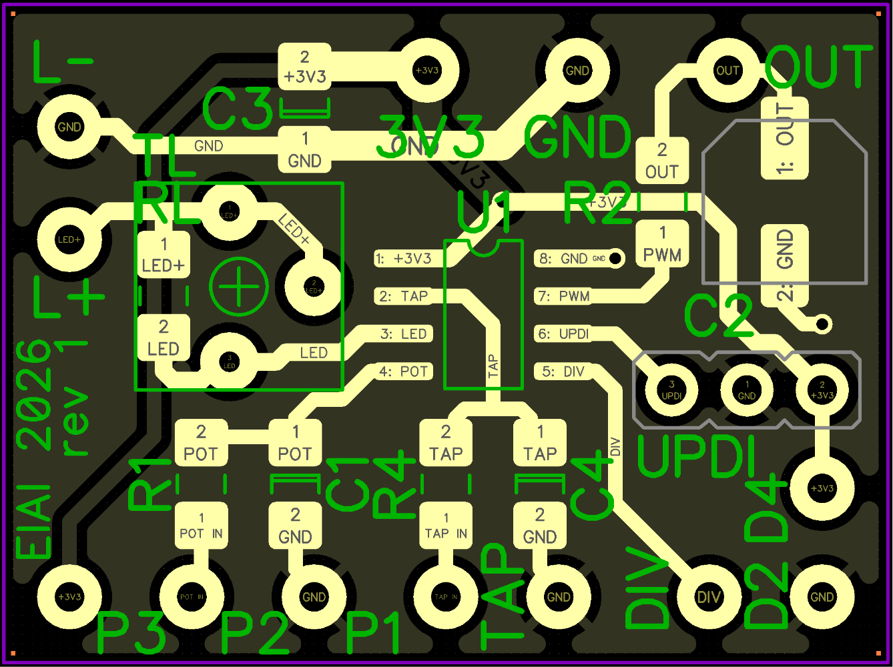

# Hydra Delay Taptempo Buddy

This is adaptation of [FV1Buddy tap tempo module](https://github.com/ElectricCanary/FV1Buddy) by [Electric Canary](https://electric-canary.com)
for use with [Hydra multi-head Delay by PedalPCB](https://www.pedalpcb.com/product/pcb238/)
(also available as a [kit at musikding.de](https://www.musikding.de/Hydra-Delay-kit)).

Finished in August 2026!

**Tip:** You can use my [Simple Serial UPDI programmer](https://github.com/ElvisAlive-Tone/updipcb) to program u-controller for this project.

## Features

- Delay time/tempo can be controlled by `Speed Pot` or tapped by `Tap Button`.
- Tap `Tap Button` at least two times to switch from `Speed Pot` control to `Tap Button` conntroll.
  - Second tap must follow under 1,5s after first one.
  - Subsequent tap times are averaged until tapping finishes.
  - Tapping finishes if next tap is not performed for at least 3 times of the currently
    tapped in tempo - `LED` blinks in the tapped tempo then with 50% duty cycle.
  - Tapped in tempo is restricted to Hydra delay time boundarties while tapping it in.
- Long tap on `Tap Button` (over 1s) launches ramping down and up through the whole delay time range, until button is released.
  - Ramping velocity depends on `Speed Pot` (cca 1.5s to 5s ramping cycle). `LED` blinks as ramping switches direction to indicate this velocity.
  - Original delay time is restored after the button release.
- Move `Speed Pot` at least 5% to switch control back to it - `LED` is on without blinking then.
- `Tap to Head switch` (optional)
  - Selects if tapped in tempo targets _Head 2_ or _Head 4_. **Tip:** Tapping
    to _Head 2_ allows you to easily set tempo in "eights" for "dotted eigts" played by _Head 3_.
  - Switch change is not used immediatelly, but for the next tapping. Also used after next pedal power-on.
- Current `Speed Pot` or `Tap Button` control state, together with the tapped in tempo, is preserved over the pedal power-off.

_Idea for another feature:_ random short Speed slowdown followed by Speed up back to the tapped in/pot tempo - idea from Rhett Shull video about tape delays. How to enable it as we do not have spare controls?

## Project Content

- **ToDo** `.hex` - firmware binary
- `firmware/` - VSCode/[PlatformIO](https://docs.platformio.org/en/latest/platforms/atmelmegaavr.html) project with firmware
- `FV1BuddyForHydra.dch` - schematics
- `FV1BuddyForHydra-rev1_gerber.zip` - Gerber file for PCB fabrication
- `FV1BuddyForHydra.dip` - PCB design file

Schematics and PCB design file can be opened/edited by [DipTrace](https://diptrace.com/).

## Applying module into Hydra

It is really easy:

- Plan tap tempo module and all new controls (`Tap Button`, `Tap to Head` switch) placement in the pedal enclosure. Use
  long enough wires for the placement.
- Do not solder `Speed` pot to the Hydra PCB, but connect its pads to the module instead:
  - you can use connector here to disconnect module easily from Hydra, eg. to re-program it.
  - closest to the PCB edge square one to `GND` - ground for the module.
  - center one to `OUT` - tempo voltage from the module back to the Hydra.
  - third one to `3V3` - 3,3V power for the module.
- `Speed` pot - connect pot's 1, 2 and 3 lugs to the module's `P1`, `P2` and `P3`.
  Use `B` type pot, from `B10k` up to Hydra's original `B100k`.
- `Tap Button` - connect momentary button to the module's `TAP` pads.
- `LED` - connect LED to the module's `L+` and `L-`. Use `TL` trimmer to set LED's brightness. Used `2k` value should
  be OK for the most LED types, if too small for your LED, use higher trimmer value, or connect additional resistor.
  in series. Alternatively use fixed value resistor `RL` if you figured out exact value and wanna to save some space.
- `Tap to Head` switch - optional, single on/on switch, connect middle to the module's `DIV` pads. Side
  for _Head 4_ to `D4`, and side for _Head 2_ to `D2` pads. If switch is not used, conenct `DIV` directly to `D4` or `D2` pad.

## Building module

Module schematics:



PCB BOM:

| Markings           | Value             | PCB packaging type                                    |
| ------------------ | ----------------- | ----------------------------------------------------- |
| R1, R2             | 1k                | 1206                                                  |
| R4                 | 10k               | 1206                                                  |
| C1, C3, C4         | 100n              | 1206                                                  |
| C2                 | 10u               | 5,3mm                                                 |
| TL                 | 2k                | 3362 trimmer                                          |
| RL (instead of TL) | matching LED      | 1206                                                  |
| U1                 | ATtiny 402 or 412 | SOIC-8                                                |
| UPDI               |                   | 3 pins header connector (male or female, it's on you) |

External components:

| Markings      | Value                  |
| ------------- | ---------------------- |
| `Speed Pot`   | B10k - B100k           |
| LED           | any color and size LED |
| `Tap Button`  | any momentary switch   |
| `Tap to Head` | any on/on switch       |

PCB:



## PWM calibration

Source code contains constants for PWM calibration to Hydra delay time range.
Used values were obtained from my Hydra and module build, I'm not sure how much they
can fluctuate for other builds, hopefully not so much.

```c
const uint16_t c_delay_max = 920;   // max delay from Hydra on head 4 [ms] - Speed pot on minimum
const uint16_t c_delay_min = 150;   // min delay from Hydra on head 4 [ms] - Speed pot on maximum
const uint16_t c_delay_range = 770; // Computed as `c_delay_max` - `c_delay_min` [ms]
```

Constants are used in `divtempo_to_pwm()`, `pot_to_pwm()`, `divtempo_range()` methods and other places where necessary.

If you have to recalibrate, set `Speed pot` as mentioned in the comment, upload to u-controller, measure delay time, and change
these constants.

I measured delay time using Ramp signal type from my signal generator, 100mV aplitude at 0.5Hz as an input.
Hydra must be on _Head 4_ only, `Mix` pot fully on the wet side to produce just delayed signal.
Two osciloscoppe channels hooked to Hydra In and Out, run manually triggered scan at `1s` Horizontal to get traces, then stop it.
Then switch Horizontal to `100ms` or `50ms` and measure subsequent In and Out edge distances.

## Compilling firmware

I'm using VS Code with Platform IO extension. You have to have `Atmel megaAVR` Platform installed in the Platform IO.

`platformio.ini` file is commited in `firmware` folder with all the basic settings,
including [pymcuprog](https://github.com/microchip-pic-avr-tools/pymcuprog) related settings for
my [Simple Serial UPDI programmer](https://github.com/ElvisAlive-Tone/updipcb).

So you can just open the folder in VS Code and it should work.

## Programming u-controller

Easiest way is to set u-controller up before soldering it to the PCB.

If you want to change firmware later, you can use UPDI pins on the module, where `GND` is middle, `UPDI` left, `VCC` right.

But be carefull, **never program it with 5V VCC when connected to Hydra**, as you can damage FV-1 DSP chip!

I recommend to always disconnect it for programming, using connector on the connection described in ["Applying module into Hydra"](#applying-module-into-hydra).

## Changes from FV1Buddy

`FV1Buddy` was forked in June 2025. It was not finished and some code parts didn't work correctly at the fork time.

Functional changes:

- `Speed pot` has opposite direction when compared to common "Delay" or "Time" pot. I have to reverse it in the firmware.
- PWM calibration to Hydra delay range is hardcoded (no callibration by tap button, you have to rebuild firmware)
- "Tempo Division Switch" allows to select taping for "Head 2" or "Head 4" of the pedal.
  It is read as a binary input instead of analog.
- "48kHz Clock Output" and related functionality is removed.
- Ramp function engages after 1s, not 2s.

Non-functional changes:

- "Momentary Tap Tempo Button Input" moved to microcontroller's pin freed by remove
  of "48kHz Clock Output". So UPDI pin is not used and "UPDI High-Voltage
  Activation" capable programmer is not necessary. You can use
  my [Simple Serial UPDI programmer](https://github.com/ElvisAlive-Tone/updipcb) and
  program u-controller on the board using `UPDI` header pins.
- Added hardware debounce circuit for the `Tap Button`.
- LED now blinks with 50% tapped in time duty cycle (was "on" for constant 8ms in the original code).
- Corrected computiong of the `pwm` value when Tab button is used.
- EEPROM storing code chaged, `avr/eeprom'h` haven't work for me (but it might be due to other problem I found later ;-).
- Implemented delayed `tap=0` storing into EEPROM to keep `tap=1` during power-off, as
  `Speed Pot` value change may be detected by u-controller as power voltage drops.
- Distinct code optimizations and refactorings to reuse common logic.
- Lots of comments added as I learnt the code.

All changes are marker by `MOD:` comment in the source code as accurately as possible, but there were lots of them.

## License

© 2025 - 2026 ElvisAlive Tone. This work is openly licensed via [CC BY-NC-SA](https://creativecommons.org/licenses/by-nc-sa/4.0/)
